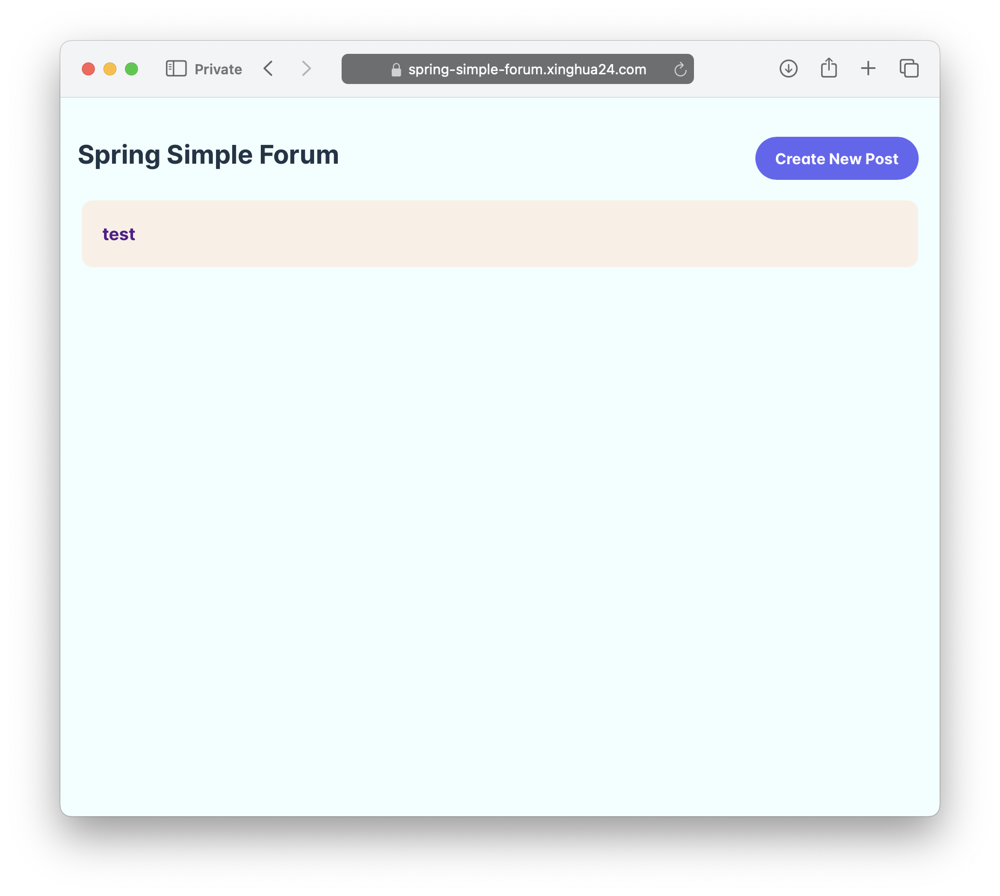

# Spring Simple Forum
Simple forum application build using SpringBoot and React.



## Build and Run Locally
Prerequisites:
* Docker
* npm
* jdk 17
* maven

1. Build UI
```bash
cd spring-simple-forum-ui
npm i
npm run build
```

2. Run mysql using Docker and run initialization script if not run already
```bash
bash ./mysql/start-mysql.sh
```

3. Run SpringBoot application locally
```bash
mvn spring-boot:run -Dspring-boot.run.profiles=local
```

Navigate to http://localhost:8080
